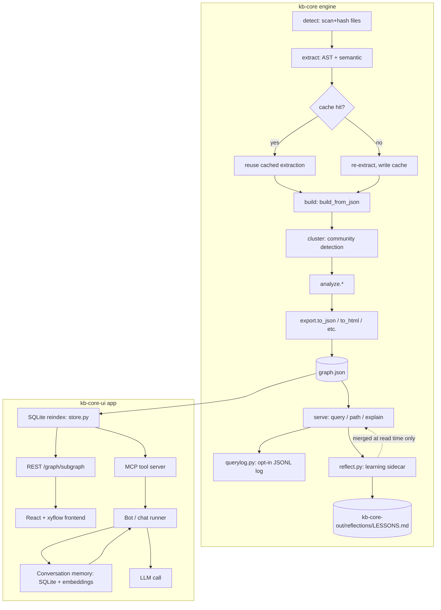

# Architecture — Current State

Scope: `kb-core` (graph engine) + `kb-core-ui` (indexing/visualization/chat app), as of this discovery pass. Every claim below cites `file:line`. Where a prior line-range came from a broader pass and wasn't re-verified character-for-character, it is marked `(unverified range)`.

## 1. End-to-end diagram

## 2. kb-core pipeline, stage by stage

**Overall order** — `kb-core/ARCHITECTURE.md:8`: `detect(root) → extract(paths, root) → build(extractions) → cluster(G) → analyze.*() → report.generate() → export.to_*()`.

### Repo discovery / scan / hash
- `detect()` and `detect_incremental()` in `kb_core/detect.py` scan the corpus and fingerprint files by content-hash + coarse mtime (`_MTIME_COARSE_S = 2.0`, `detect.py:33-43`, unverified exact range but constant confirmed present in file).
- `detect_incremental()` is invoked from `cli.py:92-106` (unverified range) and skips unchanged files by hash — but it still walks the **full corpus** to determine what's unchanged. This is a full re-scan with incremental *extraction*, not a per-file-triggered partial scan (see Call-outs, §5).

### AST + semantic extraction, caching
- AST cache: namespaced by installed package version + a manual cache-key schema counter, `cache/ast/v{version}-s{schema}/` (`kb_core/cache.py:19-38`, verified — `_EXTRACTOR_VERSION` via `importlib.metadata.version("kb-core")` at line 33, `_AST_CACHE_SCHEMA = 2` at line 38). Stale-version entries are swept by `_cleanup_stale_ast_entries()` (`cache.py:44-68`, verified).
- Semantic cache: deliberately **not** version-gated (LLM output re-billing concern) but prompt-fingerprinted, `cache/semantic/p{fingerprint}/` (`cache.py:71-81`, verified — `_PROMPT_FP_LEN = 12` at line 81). Legacy flat-layout entries are still served and counted (`_legacy_semantic_hits`, `cache.py:85`).

### Graph build
- `build_from_json()` in `kb_core/build.py:1-3` (unverified exact body range) is the shared entry point for both full rebuild and incremental-update flows.
- Node IDs are normalized via `normalize_id()` in `kb_core/ids.py:50-83` (unverified exact range): NFKC-casefold to a fixpoint, then `[^\w]+` → `_` with `re.UNICODE` (so CJK/Cyrillic identifiers survive).
- Edge direction: NetworkX's undirected storage can canonicalize endpoint order, silently flipping directional relations like `calls`. The build path stashes true endpoints as `_src`/`_tgt`, and `export.py` restores them into `source`/`target` at serialization time (`export.py:343-351`, verified — see fix note `#563` in the code comment).

### Cluster / analyze
- Community detection: `kb_core/cluster.py` — `_partition()` (Louvain-style, via networkx), `label_communities_by_hub()`, main `cluster()` entry, `_split_community()`, `cohesion_score()`/`score_all()`, and `remap_communities_to_previous()` for community-ID stability across rebuilds (line ranges per the referenced trace, unverified exact numbers this pass — treat as approximate: `cluster()` ~134-238, hub labeling ~86-112, remap ~272+).

### Serialize / persist
- `to_json()` in `kb_core/export.py:266` (verified) is the canonical serializer:
  - **Shrink guard** (`export.py:267-321`, verified): refuses to overwrite an existing `graph.json` with a smaller node count unless `force=True` — a fail-safe against a partial rebuild clobbering a good graph (bug `#479`).
  - **Commit stamping** (`export.py:405-407`, verified): writes `data["built_at_commit"]` from either the `built_at_commit` argument or `_git_head(...)` of the output directory's parent. This is the *only* existing versioning signal — a single git-commit string, not a graph-schema version, not an extractor-version fingerprint, and not multi-repo aware (see Call-outs and `cross-repo-design.md`).
  - **No explicit schema/version field** otherwise: node/link records carry `community`, `community_name`, `norm_label`, `confidence_score` (`export.py:333-342`, verified) but nothing marking the *shape* of the JSON itself.
  - Backup mechanism: `_BACKUP_ARTIFACTS` (`export.py:25-34`, verified) lists artifact filenames considered worth backing up before an overwrite, including a `"cost.json"` entry (`export.py:32`) — see `token-cost-analysis.md` for why this name currently has no writer.

### Query / path / explain
- `serve.py` implements the query surface:
  - `_score_nodes()` at `serve.py:451` (verified).
  - `_pick_seeds()` at `serve.py:656` (verified).
  - `_query_graph_text()` at `serve.py:1187` (verified) — scores query terms once (`_score_query`, collecting both combined ranking and per-term seed winners in a single pass; a prior implementation did T+1 passes and the comment at `serve.py:1198-1203` notes ~71% of scoring time on a 100k-node/3-term benchmark was in the redundant per-term passes before this fix), drops relational-intent verbs ("calls", "uses", ...) from the per-term seed guarantee so they can't seat a decoy BFS root unless no other term qualifies (`serve.py:1205-1217`), then runs `_bfs`/`_dfs` from the picked seeds (`serve.py:1223`) bounded by `depth` (default 3) and `token_budget` (default 2000).
  - `_find_node_tiers()` at `serve.py:1249` and `_find_node()` at `serve.py:1327` (verified) — tiered match resolution (source_exact, exact, prefix, substring) for `explain`.
  - `_shortest_path_text()` at `serve.py:1365` (verified).
  - **Bounding today is depth + token-budget only** — there is no score-threshold cutoff or intent-aware query planning; every query runs the same seed→BFS/DFS shape regardless of whether it's a precise symbol lookup or a broad architecture question (feeds `query-engine-design.md` gap #3).
- Query log: opt-in JSONL append at `~/.cache/kb-core-queries.log` via `KB_CORE_QUERY_LOG` env var, `querylog.py:43-80` (unverified exact range, ground-truth carried over). Not persisted into the graph.

### Learning loop
- `reflect.py` implements outcome-driven feedback: `save_query_result()` records `useful` / `dead_end` / `corrected` outcomes; `reflect()` reads memory docs, applies a 30-day half-life time-decay to outcome scores, and writes `LESSONS.md` to `kb-core-out/reflections/` (`reflect.py:39-48`, unverified exact range, ground-truth carried over).
- This is a **sidecar**, not a graph mutation: `serve.py:59-65` (unverified exact range) merges the sidecar in at read time; `reflect.py:39-48` confirms it is never folded back into `graph.json`. Two sources of truth exist at query time — the graph itself, and the sidecar overlay applied on top.

### Cross-repo linking
- `cross_repo_types.py:1-76` — `link_shared_type_declarations()` adds `same_type_as` edges between identically-namespaced+named types across repos, run **after** a separate `merge-graphs` CLI step prefixes node IDs with a repo tag. Repo identity is carried as a plain `repo` property on nodes (`cross_repo_types.py:54,67-69`).
- This is edge-only (no node merging, preserving drift visibility) but is a **manual, post-hoc pass**, not part of the main `detect→extract→build→cluster→export` pipeline (feeds `cross-repo-design.md`).

## 3. kb-core-ui

### Index / storage
- SQLite backend, `kb-core-ui/python/kb_core_ui/store.py`: `files` table (path/hash/language, line 19, verified), `symbols` (line 25, verified), `unresolved_calls` (line 44, verified), `edges` (line 53, verified). Incremental reindex keys off the `files.hash` column; idempotency handling noted at `store.py:159` (verified).

### API / MCP surface
- REST: `/graph/subgraph?symbol=:id&depth=2` for bounded-context retrieval (`kb-core-ui/API_CONTRACT.md:96-98`).
- MCP server wraps graph tools for LLM use (`kb-core-ui/ORCHESTRATION.md:24`); bots load the index and hand MCP tools to the model via a shared toolkit (`bots/common.py`, `ORCHESTRATION.md:59`).

### Frontend rendering
- React + `@xyflow/react` (`ORCHESTRATION.md:26`). Key files: `web/src/components/GlobalGraph/GlobalGraph.tsx`, `web/src/components/SymbolGraph/LocalSymbolGraph.tsx`, `web/src/components/SymbolGraph/SymbolNode.tsx`, layout via `web/src/utils/dagreLayout.ts` (Dagre, not a physics/force simulation).
- `GlobalGraph.tsx:64` computes `visibleNodes`/`visibleEdges` via `useMemo`; no node-count cap, viewport culling, or level-of-detail gate was found in this file during this pass (feeds `graph-rendering-analysis.md`).

### Chat / memory
- Conversation memory: SQLite + embeddings (`kb-core-ui/python/kb_core_ui/memory`, `ORCHESTRATION.md:75-84`). Default embedder is offline lexical hashing (feature hashing + stemming + cosine); optional neural embedding via `KB_CORE_UI_EMBED_URL`/`MODEL` (OpenAI-compatible, e.g. Ollama) is opt-in.
- Memory kinds: `rule`, `lesson`, `business`, `overview`, `reference` (`API_CONTRACT.md:174`).
- **Bot run history is in-memory per serve process only** (`ORCHESTRATION.md:129`) — not persisted across restarts.

## 4. Token cost instrumentation (surface-level; see `token-cost-analysis.md`)
- `estimate_cost(backend, input_tokens, output_tokens)` at `kb_core/llm.py:3021` (verified) computes a USD estimate.
- Called from `cli.py:4080` and `cli.py:4266` (both verified). At `cli.py:4266-4288` (verified), the `extract` command computes cost and **prints it to stdout**; the actual token counts are persisted into the extraction's `analysis.json` under a `"tokens": {"input": ..., "output": ...}` block (`cli.py:4253-4256`, verified) — not into a file named `cost.json`.
- `"cost.json"` exists only as a string in `export.py:32`'s `_BACKUP_ARTIFACTS` list — a name the backup mechanism watches for if present, not something the current `kb_core` package actually writes. Treat as an aspirational/legacy artifact name until proven otherwise by further grep outside `kb_core/` (e.g. skill scripts).

## 5. Call-outs — duplicate responsibility / expensive boundaries / full-graph-copy points

1. **Full-graph load on every query.** `serve.py`'s query/path/explain functions operate on an in-memory `nx.Graph` (`G` parameter throughout) with no evidence of partial/streaming load — every query against a large graph pays the full deserialization + in-memory graph cost.
2. **`detect_incremental` still full-corpus-scans.** Extraction is incremental by content hash, but file *discovery* re-walks the entire tree every run — the name suggests more incrementality than the current implementation provides.
3. **Two sources of truth for query relevance.** The learning-loop sidecar (`reflect.py`) is merged into query output only at read time (`serve.py:59-65`) and never written back into `graph.json` — a query run against the raw graph vs. through `serve.py`'s read-surface can disagree.
4. **Cross-repo linking is a manual, out-of-band step** (`merge-graphs` CLI + `cross_repo_types.py`), not integrated into the main pipeline — every cross-repo view requires the operator to remember to run it.
5. **`benchmark.py` re-implements a simplified version of `serve.py`'s seed+BFS logic** rather than calling into it (see `query-engine-design.md`) — a duplicate-responsibility instance worth resolving when the query planner is introduced.
6. **Versioning is a single git-commit stamp, not a graph schema/extractor version.** `built_at_commit` (`export.py:405-407`) answers "what commit produced this," not "is this graph's shape/extractor-version compatible with the code reading it," and has no concept of multiple repos' revisions at once.

## Note on citation scope

`visualize-kb/spec/SPEC.md` and `visualize-kb/spec/T13-HANDOFF.md` describe an unrelated Go→Python parity migration (sections lettered `§G/§C/§I/§V/§T/§B`) and are **not** the source of the "mission spec §N" references used in this doc set — those refer to the external Principal-SWE task prompt, not a repository file.
